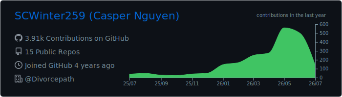
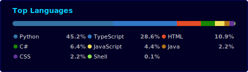

### About Me 🇻🇳🇨🇦

I'm Casper, a Software Engineer with 2+ years of experience.

I graduated from the University of Alberta in 2025 with a Bachelor of Science in Computing Science. Most of my work is focused on full-stack web development, with a specialty in integrating AI features into existing software. 

- :seedling: I have a special passion for automation (writing Bash scripts, Cloud CI/CD pipelines), writing good documentation, and maintaining clean code.
- :zap: I also enjoy (and have some experience in) Mobile Development.
- :e-mail: nguyentrungycs@gmail.com

    

---

### Tools I Commonly Use 🛠️

#### Languages

  &nbsp;
  &nbsp;
  &nbsp;
  &nbsp;

#### Frontend

  &nbsp;
  &nbsp;
  &nbsp;
  &nbsp;
  &nbsp;
  &nbsp;

#### Backend, APIs & Data

  &nbsp;
  &nbsp;
  &nbsp;
  &nbsp;
  &nbsp;
  &nbsp;
  &nbsp;
  &nbsp;
  &nbsp;
  &nbsp;
  &nbsp;

#### Cloud, DevOps & QA

  &nbsp;
  &nbsp;
  &nbsp;
  &nbsp;
  &nbsp;
  &nbsp;
  &nbsp;
  &nbsp;

#### AI, Product & Workflow Tools

  &nbsp;
  &nbsp;
  &nbsp;

---

### GitHub Snapshot 🔥

**Profile overview**

**Languages**

**Contribution streak**

